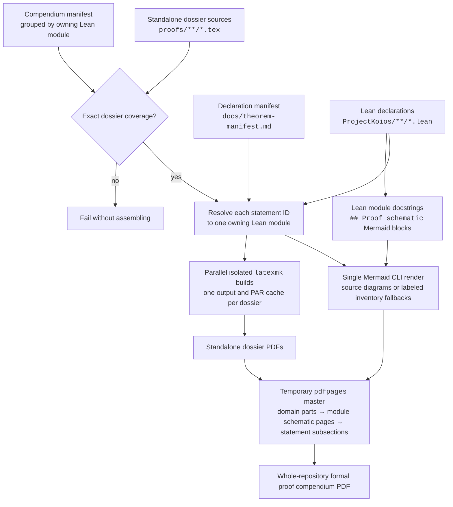

# Proof compendium build schematic

```mermaid
flowchart TD
    dossiers["Standalone dossier sources<br/><code>proofs/**/*.tex</code>"]
    manifest["Compendium manifest<br/>grouped by owning Lean module"]
    coverage{"Exact dossier coverage?"}
    theoremManifest["Declaration manifest<br/><code>docs/theorem-manifest.md</code>"]
    leanSources["Lean declarations<br/><code>ProjectKoios/**/*.lean</code>"]
    ownership["Resolve each statement ID<br/>to one owning Lean module"]
    sourceSchematics["Lean module docstrings<br/><code>## Proof schematic</code> Mermaid blocks"]
    render["Single Mermaid CLI render<br/>source diagrams or labeled inventory fallbacks"]
    compile["Parallel isolated <code>latexmk</code> builds<br/>one output and PAR cache per dossier"]
    pdfs["Standalone dossier PDFs"]
    master["Temporary <code>pdfpages</code> master<br/>domain parts → module schematic pages → statement subsections"]
    compendium["Whole-repository formal proof compendium PDF"]

    dossiers --> coverage
    manifest --> coverage
    coverage -->|yes| ownership
    coverage -->|no| fail["Fail without assembling"]
    theoremManifest --> ownership
    leanSources --> ownership
    leanSources --> sourceSchematics
    sourceSchematics --> render
    ownership --> render
    ownership --> compile
    compile --> pdfs
    render --> master
    pdfs --> master
    master --> compendium
```

No generated node in this diagram is committed. The manifest and builder are the reproducible source
for the assembled artifact.
